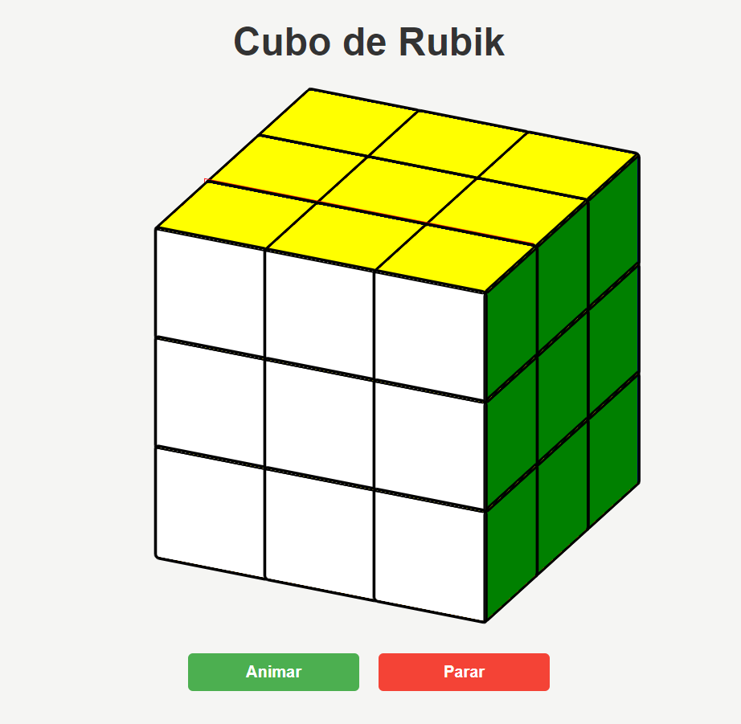

# Cubo de Rubik

  
   

 Projetinho bem simples apenas para criar um Cubo de Rubik 3D com alguma animação. Foram usados aqui apenas HTML e CSS puro com uma mini função em javascript apenas para iniciar ou parar a animação 

